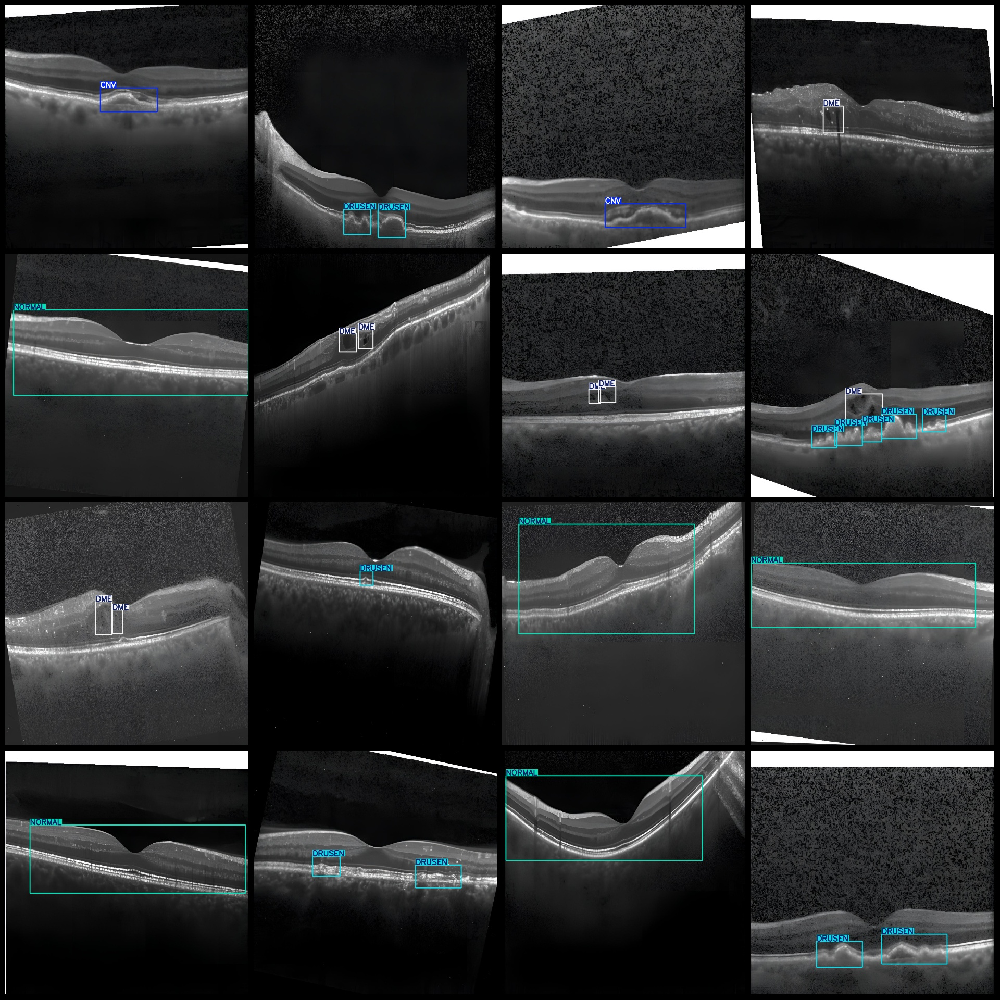
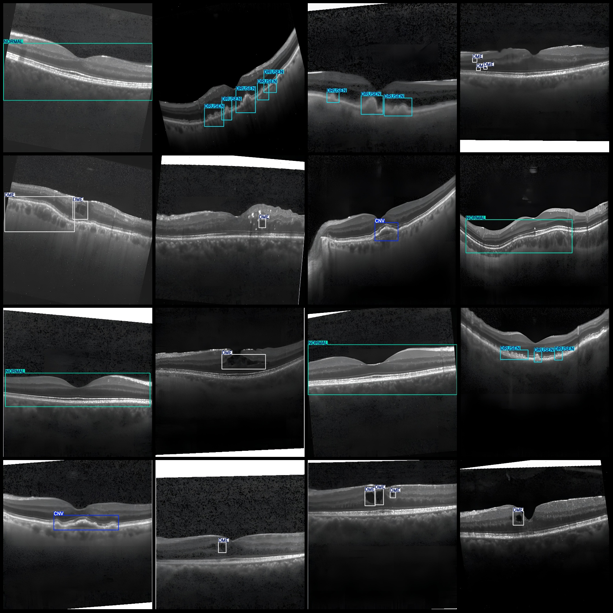
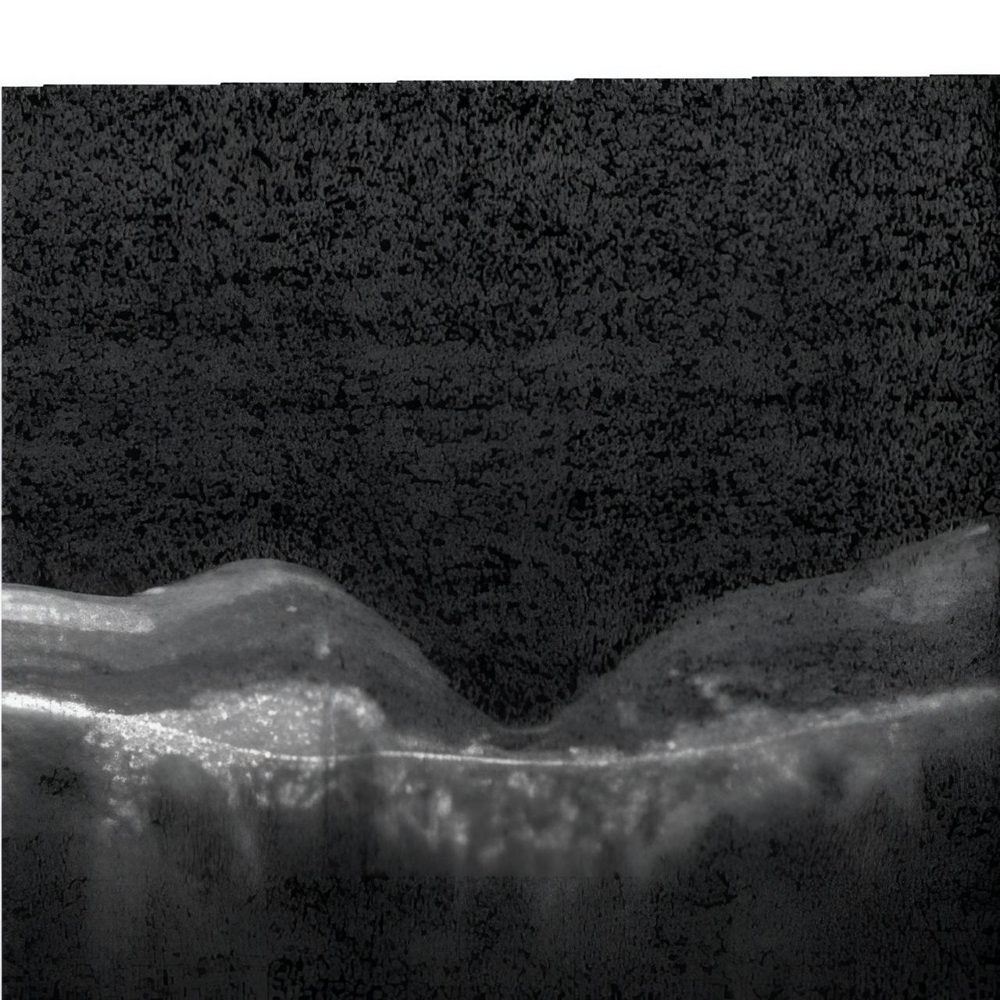
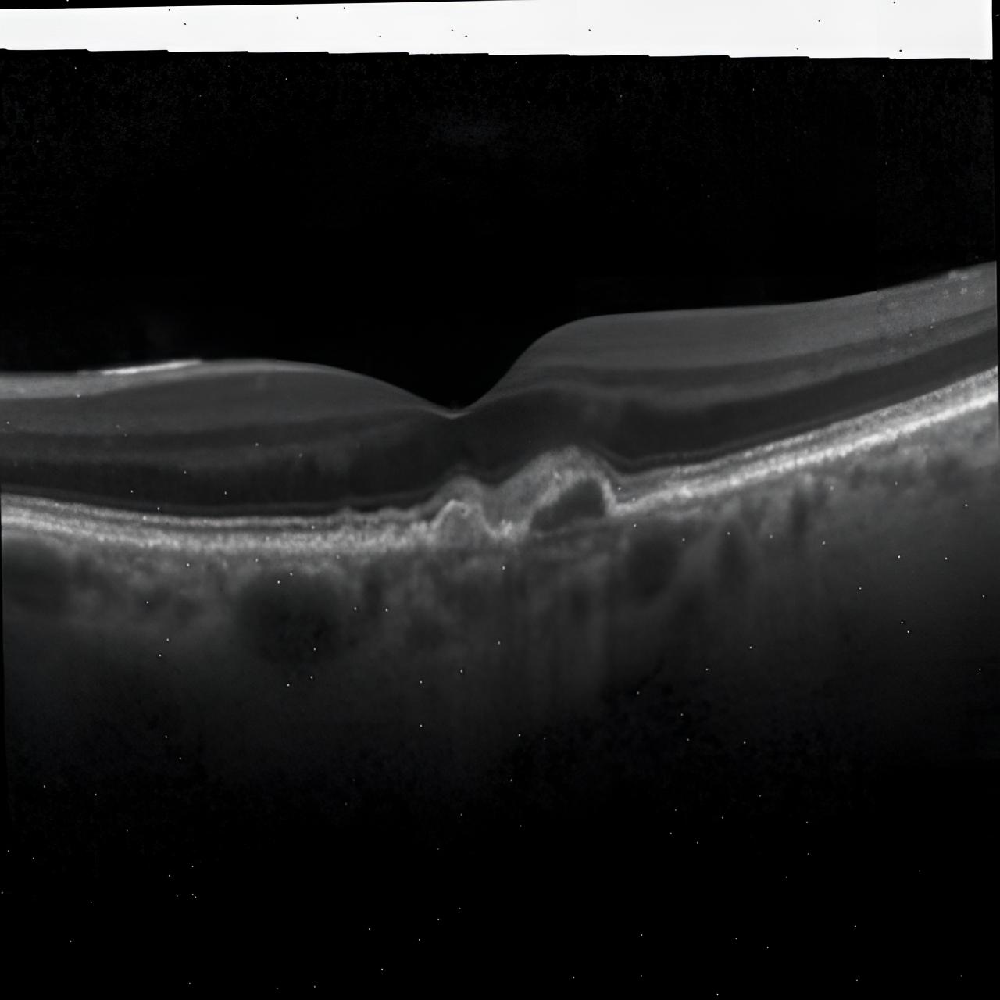
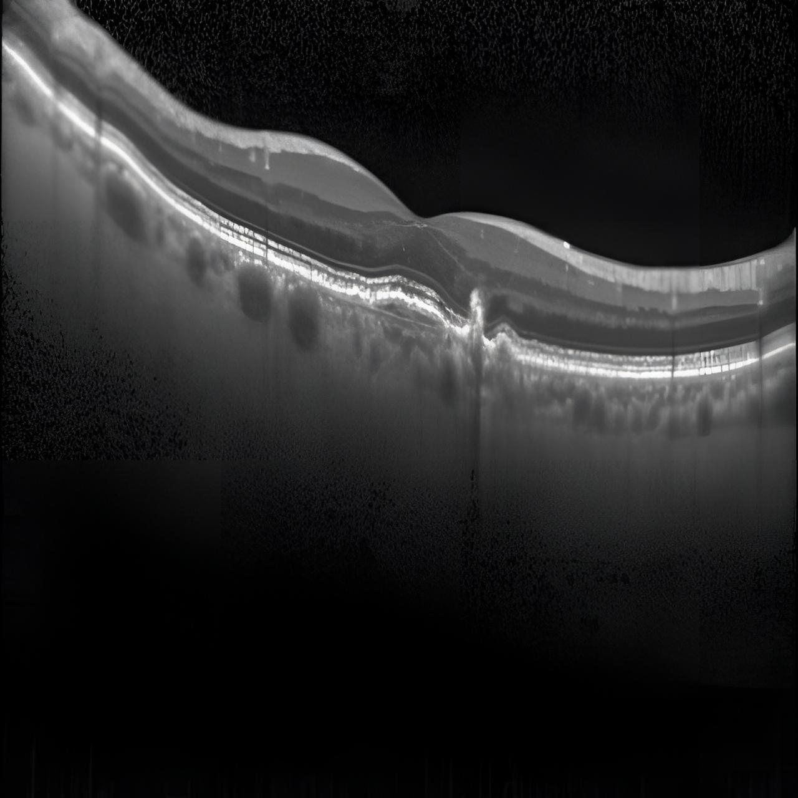

# Smart Medical Retinal OCT Image Optical Coherence Tomography Eye Disease Detection Dataset VOC+YOLO Format: 1038 Images, 4 Categories

Dataset format: Pascal VOC format + YOLO format (txt file without split path, only containing jpg images and corresponding VOC format xml files and yolo format txt files)
Number of images (jpg file count): 1038
Number of annotations (xml file count): 1038
Number of annotations (txt file count): 1038
Number of categories: 4
Annotation category names (note that the order of categories in the yolo format does not correspond to this, but is based on the labels folder classes.txt): ["CNV", "DME", "DRUSEN", "NORMAL"]
Number of bounding boxes for each category:
- CNV (Choroid Neovascularization) = 223
- DME (Diabetic Macular Edema) = 596
- DRUSEN (Glaucoma Epiretinal Hydrops) = 698
- NORMAL (Normal) = 300
Total bounding boxes: 1817
Number of images per category:
- CNV = 171
- DME = 313
- DRUSEN = 275
- NORMAL = 300
Image resolution: 1280x1280
Annotation tool used: labelImg
Annotation rules: draw bounding boxes for categories
Important note: The dataset does not have been divided into training, validation, or test sets; you must divide it yourself.
Special notice: This dataset does not guarantee any accuracy of the trained model or weight files.
Image preview:

## Images

Here is a pay link on Stripe ( https://buy.stripe.com/3cs8yP7sY87d0vu9AB ). Please contact me lonlonago@foxmail.com after funding $89, and I will send you a complete data files , thank you!

